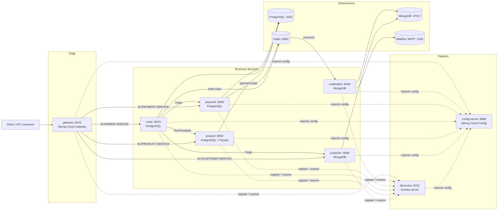

# E-Commerce Backend Platform

A distributed, cloud-native **e-commerce backend** built with the **Spring Cloud**
microservices stack. A monolithic e-commerce domain is decomposed into
independently deployable services, each owning its own data store and exposing a
REST API, wired together with service discovery, an API gateway, centralized
configuration and asynchronous Kafka messaging.

> **New here?** Jump straight to [Running the system](#running-the-system) — a
> single script (`start-system.sh`) brings up infrastructure and all 8 services
> in the correct order, waiting for real readiness at every step.

---

## Table of contents

1. [Overview](#overview)
2. [Architecture](#architecture)
3. [Tech stack](#tech-stack)
4. [Repository structure](#repository-structure)
5. [Prerequisites](#prerequisites)
6. [Configuration](#configuration)
7. [Running the system](#running-the-system)
8. [Docker Compose](#docker-compose)
9. [Startup order](#startup-order)
10. [Development](#development)
11. [Testing](#testing)
12. [API documentation](#api-documentation)
13. [Kafka events](#kafka-events)
14. [Authentication & Security](#authentication--security)
15. [Troubleshooting](#troubleshooting)
16. [Useful commands](#useful-commands)
17. [Known limitations](#known-limitations)
18. [Production considerations](#production-considerations)
19. [Further documentation](#further-documentation)

---

## Overview

The platform implements the full checkout flow of an online store, from customer
and product management through order placement, payment and email notification.
Its goal is to demonstrate the practical building blocks of a microservices
architecture rather than a single deployed product:

* **Service discovery** — Netflix Eureka, so services find each other by name.
* **API gateway** — Spring Cloud Gateway as the single entry point (`:8222`),
  validating Keycloak-issued JWTs (OAuth2 resource server).
* **Externalized configuration** — Spring Cloud Config Server (native profile).
* **Synchronous calls** — OpenFeign + Spring Cloud LoadBalancer between services.
* **Asynchronous events** — Apache Kafka for order/payment notifications.
* **Database per service** — PostgreSQL for product/order/payment, MongoDB for
  customer/notification.
* **Database migrations** — Flyway for the product catalog.
* **Observability** — Actuator health endpoints and Micrometer/Brave tracing
  configuration.

There is **no frontend** in this repository; it is a backend-only project. All
business endpoints are intended to be called through the gateway.

---

## Architecture



**Checkout flow (orchestration saga):**

1. `order-service` receives `POST /api/v1/orders` (through the gateway).
2. It validates the customer via `customer-service` (Feign).
3. It reserves stock via `product-service` (REST).
4. It persists the order and its order lines.
5. It creates the payment via `payment-service` (Feign).
6. It publishes an `OrderConfirmation` event to Kafka (`order-topic`).
7. `payment-service` persists the payment and publishes to `payment-topic`.
8. `notification-service` consumes both topics and sends an email via MailDev.

Inter-service calls happen **at request time**, not at startup — which is why
the business services can all boot in parallel (see [Startup order](#startup-order)).

---

## Tech stack

| Area | Technology | Version |
|---|---|---|
| Language | Java | 17 (`<java.version>17</java.version>`) |
| Framework | Spring Boot | 3.2.5 |
| Cloud | Spring Cloud | 2023.0.1 |
| Build | Maven (wrapper per module) | 3.8.x / 3.9.x |
| Service discovery | Netflix Eureka (Spring Cloud Netflix) | — |
| API gateway | Spring Cloud Gateway | — |
| Config | Spring Cloud Config Server (native) | — |
| Sync calls | OpenFeign, Spring Cloud LoadBalancer | — |
| Messaging | Apache Kafka (Confluent images) | 7.6.1 |
| Relational DB | PostgreSQL | (compose default image) |
| Document DB | MongoDB | 7.0 |
| Migrations | Flyway | — |
| Email (dev) | MailDev | latest |
| Observability | Spring Boot Actuator, Micrometer/Brave tracing config | — |

Each service is an **independent Maven project** — there is **no root
aggregator POM**, so build and run commands are per module (or driven by
`start-system.sh`).

---

## Repository structure

```
e-commerce-app/
├── config-server/      # Spring Cloud Config Server (native profile, :8888)
│   └── src/main/resources/configurations/   # per-service YAML served to clients
├── discovery/          # Eureka server (:8761)
├── gateway/            # Spring Cloud Gateway (:8222)
├── customer/           # Customer CRUD        (MongoDB,  :8090)
├── product/            # Product catalog      (PostgreSQL + Flyway, :8050)
├── order/              # Order orchestration  (PostgreSQL, :8070)
├── payment/            # Payment processing   (PostgreSQL, :8060)
├── notification/       # Kafka consumers + email (MongoDB, :8040)
├── docs/               # Project documentation
│   ├── architecture.md
│   ├── api.md
│   ├── database.md
│   ├── deployment.md
│   ├── tests.md
│   ├── startup-script.md
│   └── final-code-review.md
├── docker-compose.yml  # Infrastructure: Postgres, Mongo, Kafka/ZK, MailDev, pgAdmin, mongo-express
├── start-system.sh     # Ordered startup / shutdown orchestrator
└── README.md           # This file
```

Each service directory follows the standard Spring Boot layout
(`src/main/java`, `src/main/resources`, `pom.xml`, `mvnw`).

---

## Prerequisites

| Tool | Version | Needed for |
|---|---|---|
| **JDK** | **17 or 21** | Compiling and running the services |
| Docker Engine | 20.x+ | Infrastructure containers |
| Docker Compose | v2 (`docker compose`) | Multi-container orchestration |
| Bash | ≥ 4 | `start-system.sh` |
| `curl`, `grep`, `sed`, `awk` | any | Readiness probes in the script |
| Maven | optional | Only if you build manually — each module ships `mvnw` |

> **Important:** use **JDK 17 or 21**. The services use Lombok 1.18.30, which
> does **not** compile under Java 22+. `start-system.sh` auto-detects a
> compatible JDK under `~/.jdks`, `~/.sdkman` and `/usr/lib/jvm`, and ignores a
> `JAVA_HOME` that points at an incompatible version.

---

## Configuration

All runtime configuration is **externalized** to the `config-server`, which runs
with the `native` profile and serves YAML files from
`config-server/src/main/resources/configurations/`:

* `application.yml` — shared defaults (Eureka URL, tracing sampling).
* `<service-name>.yml` — per-service settings (port, datasource, Kafka, mail).

Every service bootstraps with:

```yaml
spring:
  config:
    import: optional:configserver:http://localhost:8888
```

Because of the `optional:` prefix, a service **will still start if the
config-server is down** — but it then has *no* port, datasource or Kafka
settings, so it will not actually work. That is why the config-server must be
started (and healthy) first; see [Startup order](#startup-order).

### Environment variables

The config-server YAMLs externalize credentials and endpoints with local dev
fallbacks (defaults are intentionally *not* reproduced here — see the YAMLs and
`docker-compose.yml`). For any real environment, override them with environment
variables / a secrets manager before deploying — see `docs/deployment.md`.

| Variable | Used by | Notes |
|---|---|---|
| `POSTGRES_USER` / `POSTGRES_PASSWORD` | order-, payment-, product-service | PostgreSQL credentials (dev fallback) |
| `MONGO_USER` / `MONGO_PASSWORD` / `MONGO_HOST` | customer-, notification-service | MongoDB credentials/host (dev fallbacks) |
| `KAFKA_BOOTSTRAP_SERVERS` | notification-service (consumer) | Default `localhost:9092` |
| `MAIL_HOST` / `MAIL_USER` / `MAIL_PASSWORD` / `MAIL_FROM` | notification-service | SMTP endpoint and sender address (default sender `no-reply@ecommerce.local`) |
| `PGADMIN_DEFAULT_EMAIL` / `PGADMIN_DEFAULT_PASSWORD` | docker-compose (pgAdmin) | pgAdmin login — see `docker-compose.yml` |

`start-system.sh` additionally honors `LOG_DIR`, `PID_DIR`, `INFRA_TIMEOUT`,
`CONFIG_TIMEOUT`, `DISCOVERY_TIMEOUT`, `SERVICE_TIMEOUT`, `POLL_INTERVAL`,
`LOG_TAIL_LINES`, `PG_USER` and `JAVA_HOME` — see
[docs/startup-script.md](docs/startup-script.md).

> Note: `order-service` and `payment-service` **producers** still hard-code
> `localhost:9092` in their YAML; only the notification consumer is
> env-overridable today.

---

## Running the system

### Recommended: the startup script

`start-system.sh` starts the Docker infrastructure, waits for it to be ready,
creates the required PostgreSQL databases on a fresh volume, then starts
`config-server` → `discovery` → the six business services **in parallel**,
polling each with its real health endpoint. It stays in the foreground and
shuts everything down cleanly on `Ctrl+C`.

```bash
# Full system (infrastructure + all 8 services)
./start-system.sh start

# Reuse already-running containers
./start-system.sh start --skip-infra

# Only the Docker infrastructure (no Java services)
./start-system.sh start --infra-only

# Health table for a running system
./start-system.sh status

# Follow one service's log
./start-system.sh logs order

# Stop everything
./start-system.sh stop            # services only
./start-system.sh stop --infra    # services + containers
```

A successful start ends with a table like:

```text
==== System is UP ====
  SERVICE            PORT   STATUS      LOG
  config-server      8888   healthy     .run/logs/config-server.log
  discovery          8761   healthy     .run/logs/discovery.log
  gateway            8222   healthy     .run/logs/gateway.log
  customer           8090   healthy     .run/logs/customer.log
  product            8050   healthy     .run/logs/product.log
  payment            8060   healthy     .run/logs/payment.log
  order              8070   healthy     .run/logs/order.log
  notification       8040   healthy     .run/logs/notification.log
```

Logs are written to `.run/logs/<service>.log` and PID files to
`.run/pids/<service>.pid` (both under `.run/`, which is git-ignored).
See **[docs/startup-script.md](docs/startup-script.md)** for the full guide,
environment variables and failure handling.

### Manual start (without the script)

Infrastructure first, then the services in dependency order:

```bash
docker compose up -d
```

```bash
# 1) Config server — must be healthy before anything else
./config-server/mvnw -f config-server/pom.xml spring-boot:run

# 2) Discovery (Eureka)
./discovery/mvnw -f discovery/pom.xml spring-boot:run

# 3) Business services — can start in any order once 1 & 2 are up
./gateway/mvnw      -f gateway/pom.xml      spring-boot:run
./customer/mvnw     -f customer/pom.xml     spring-boot:run
./product/mvnw      -f product/pom.xml      spring-boot:run
./payment/mvnw      -f payment/pom.xml      spring-boot:run
./order/mvnw        -f order/pom.xml        spring-boot:run
./notification/mvnw -f notification/pom.xml spring-boot:run
```

Then verify registration at Eureka: <http://localhost:8761>.

> **Note:** `order-service` and `payment-service` call other services *through
> the gateway* at runtime, so the gateway should be up before you exercise the
> checkout flow (it is not required for their startup).

---

## Docker Compose

`docker-compose.yml` provisions the **backing infrastructure only** — the Java
services run on the host (via `start-system.sh` or Maven):

| Compose service | Container | Host port | Purpose |
|---|---|---|---|
| `postgresql` | `ms_pg_sql` | 5432 | Databases `order`, `payment`, `product` (created on demand by the script) |
| `pgadmin` | `ms_pgadmin` | 5050 | PostgreSQL web UI |
| `mongodb` | `mongo_db` | 27017 | Databases `customer`, `notification` |
| `mongo-express` | `mongo_express` | 8081 | MongoDB web UI |
| `zookeeper` | `zookeeper` | 22181 → 2181 | Kafka coordination |
| `kafka` | `ms_kafka` | 9092 | Advertised listener `localhost:9092` |
| `mail-dev` | `ms-mail-dev` | 1080 (UI) / 1025 (SMTP) | Catches all outgoing mail |

Images are pinned for known compatibility reasons (see comments in the file):
`confluentinc/cp-kafka` / `cp-zookeeper` **7.6.1** (v8 is KRaft-only and crashes
with this ZooKeeper-based config) and `mongo` **7.0** (`:latest` fails on Linux
kernels ≥ 6.19). Zipkin is intentionally commented out — no collector runs
today (see [Known limitations](#known-limitations)).

---

## Startup order

| Phase | What starts | Why it must wait |
|---|---|---|
| 1 | Docker infrastructure (`postgres`, `mongodb`, `kafka` + `zookeeper`, `mail-dev`) | Nothing depends on it being *first*, but services are unhealthy without it |
| 2 | `config-server` (`:8888`) | Every other service imports its configuration from here |
| 3 | `discovery` / Eureka (`:8761`) | Clients register with, and the gateway resolves, the registry |
| 4 | `gateway`, `customer`, `product`, `payment`, `order`, `notification` (**parallel**) | Only depend on phases 2–3; inter-service calls happen at request time |

The single sequential chain is
**infrastructure → config-server → discovery → wave of business services**.
All six business services start together; none blocks another at boot.

**Health endpoints used for readiness:**

| Service | Port | Health check |
|---|---|---|
| config-server | 8888 | `GET /actuator/health` |
| discovery | 8761 | `GET /eureka/apps` (no Actuator dependency) |
| gateway | 8222 | `GET /actuator/health` (Keycloak on `:9098` must be up for JWT validation) |
| customer | 8090 | `GET /actuator/health` |
| product | 8050 | `GET /actuator/health` |
| payment | 8060 | `GET /actuator/health` |
| order | 8070 | `GET /actuator/health` |
| notification | 8040 | `GET /actuator/health` |

`/actuator/health` returns HTTP **503** while a backing store (Postgres, Mongo,
Kafka, SMTP) is unreachable, so waiting on it is a real availability gate.

---

## Development

Because there is **no parent POM**, work happens per module:

```bash
# Run a single service in dev mode (config-server must be up)
./customer/mvnw -f customer/pom.xml spring-boot:run

# Build one service
./customer/mvnw -f customer/pom.xml clean package -DskipTests

# Compile everything (repeat per module, or loop over the service dirs)
for d in config-server discovery gateway customer product order payment notification; do
  ./$d/mvnw -f $d/pom.xml clean package -DskipTests
done
```

**Editing configuration:** change the YAML under
`config-server/src/main/resources/configurations/`, then restart `config-server`
and the affected service. Credentials and infrastructure coordinates are read
from environment variables with development defaults (`POSTGRES_USER` /
`POSTGRES_PASSWORD`, `MONGO_USER` / `MONGO_PASSWORD`, `MAIL_USER` /
`MAIL_PASSWORD`, `MAIL_FROM`, `KAFKA_BOOTSTRAP_SERVERS`). `order-service` and
`payment-service` use `spring.jpa.hibernate.ddl-auto: update`, so their schema is
kept in sync without dropping existing data; `product-service` uses `validate`,
backed by Flyway.

**Adding a database migration (product-service):** add a new file following
`V{next}__{Description}.sql` under `product/src/main/resources/db/migration/`
and restart the service. Never edit an existing migration. See
[docs/database.md](docs/database.md).

---

## Testing

Every module contains a Spring Boot `*ApplicationTests` context-load smoke test,
and the business modules ship Mockito unit tests for their services and mappers.
Run tests per module (again, no aggregator):

```bash
# From the repository root
./config-server/mvnw -f config-server/pom.xml test
./discovery/mvnw     -f discovery/pom.xml     test
./gateway/mvnw       -f gateway/pom.xml       test
./customer/mvnw      -f customer/pom.xml      test
./product/mvnw       -f product/pom.xml       test
./order/mvnw         -f order/pom.xml         test
./payment/mvnw       -f payment/pom.xml       test
./notification/mvnw  -f notification/pom.xml  test

# All modules at once
for d in config-server discovery gateway customer product order payment notification; do
  ./$d/mvnw -f $d/pom.xml test || exit 1
done
```

The unit tests are plain Mockito tests and need no infrastructure:

```bash
(cd product && ./mvnw -o test -Dtest='ProductServiceTest,ProductMapperTest')
(cd payment && ./mvnw -o test -Dtest='PaymentServiceTest,PaymentMapperTest')
```

**Current status: 48 tests across the 8 modules — all passing on JDK 21**
(order 11, product 21, payment 6, customer 4, notification 3, plus one context
test each in config-server/discovery/gateway), including regression tests for
every fix listed in [docs/final-code-review.md](docs/final-code-review.md).

Context tests load the full Spring context and expect the local Docker
infrastructure to be reachable (start it with
`./start-system.sh start --infra-only`). For a production-like
setup, the recommended next step is **Testcontainers** (PostgreSQL + Kafka).
See [docs/tests.md](docs/tests.md) for the full strategy.

---

## API documentation

There is **no Swagger/OpenAPI integration** in this project (no springdoc
dependency), so there is no generated UI. The API is documented by hand in
**[docs/api.md](docs/api.md)**, covering request/response bodies for customer,
product, order and payment services plus error formats.

Base URL through the gateway:

```
http://localhost:8222
```

| Gateway path | Routes to |
|---|---|
| `/api/v1/customers/**` | `customer-service` |
| `/api/v1/products/**` | `product-service` |
| `/api/v1/orders/**` | `order-service` |
| `/api/v1/order-lines/**` | `order-service` |
| `/api/v1/payments/**` | `payment-service` |

Example:

```bash
curl http://localhost:8222/api/v1/products
```

Gateway discovery-locator auto-routing is **disabled**: only the five explicit
route patterns above are exposed; registered services are *not* reachable via
`/{serviceId}/**`.

---

## Kafka events

The checkout flow is asynchronous via Kafka (JSON serialization with
type-mapping headers; topics auto-declared by `NewTopic` beans at startup):

| Topic | Producer | Consumer | Payload | Purpose |
|---|---|---|---|---|
| `order-topic` | order-service | notification-service (`orderGroup`) | `OrderConfirmation` (reference, total, method, customer, purchased products) | Order confirmation email |
| `payment-topic` | payment-service | notification-service (`paymentGroup`) | `PaymentNotificationRequest` (order ref, amount, method, customer) | Payment confirmation email |

Details:

* order-service publishes **only after the database transaction commits**
  (`TransactionSynchronization.afterCommit`).
* Consumer deserialization is restricted to trusted packages
  (`com.ichaabane.ecommerce.kafka.order` / `...kafka.payment`).
* Kafka bootstrap is `localhost:9092` (notification consumer overridable via
  `KAFKA_BOOTSTRAP_SERVERS`).

---

## Authentication & Security

### Architecture

Keycloak acts as the Identity Provider and the **API gateway is the security
entry point** of the platform. It validates every incoming Bearer JWT against
the Keycloak realm before forwarding the request to a business service:

```
Client
  │  Authorization: Bearer <JWT>
  ▼
API Gateway (:8222) ── validates JWT (issuer + JWKS) ◄── Keycloak (:9098)
  │
  ▼  authenticated request forwarded
Microservices (customer / product / order / payment / notification)
```

### Keycloak

* **Keycloak is the Identity Provider** (OAuth2 / OIDC, realm `micro-services`).
* The **gateway validates the incoming access token** — it is an OAuth2
  *resource server* (`spring-boot-starter-oauth2-resource-server`, reactive).
* JWT signature and claims are verified by **Spring Security** (no custom
  token handling): the issuer is configured via
  `spring.security.oauth2.resourceserver.jwt.issuer-uri` and the JWKS endpoint
  is discovered automatically from the realm's OIDC metadata.
* **All five documented routes require a valid JWT** — there are no public
  business routes.
* **Authorization:** not yet configured. Any valid, unexpired token from the
  realm authenticates; no role/scope checks exist yet (see Known limitations).
* CSRF is **disabled** at the gateway: the API is stateless Bearer-token auth
  with no cookies and no server-side sessions, so classic CSRF does not apply.
* Business services themselves still trust the gateway (no per-service
  authentication); direct service ports bypass the gateway (see
  [security/attack-surface.md](security/attack-surface.md) AS-2).

Full details: [docs/security/keycloak.md](docs/security/keycloak.md).

### Configuration

The gateway issuer URI is env-overridable (development fallback committed):

```bash
# used by gateway/src/main/resources/application.yml
KEYCLOAK_ISSUER_URI=http://<KEYCLOAK_URL>/realms/<KEYCLOAK_REALM>
```

The Keycloak admin bootstrap credentials in `docker-compose.yml` are also
env-overridable:

```bash
KEYCLOAK_ADMIN=<admin-user>
KEYCLOAK_ADMIN_PASSWORD=<admin-password>
```

### Running Keycloak

```bash
docker compose up -d keycloak
```

The admin console is at `http://localhost:9098` (container port 8080). The
realm `micro-services` is created manually through the console in development
(there is no realm-import file in the repository).

### Getting a token (development)

Using the [password grant](https://www.oauth.com/oauth2-servers/password-grant/)
against the realm's token endpoint (placeholders — use your own dev user and
never commit real credentials):

```bash
curl -X POST "http://localhost:9098/realms/<KEYCLOAK_REALM>/protocol/openid-connect/token" \
  -H "Content-Type: application/x-www-form-urlencoded" \
  -d "grant_type=password" \
  -d "client_id=<KEYCLOAK_CLIENT_ID>" \
  -d "username=<DEV_USERNAME>" \
  -d "password=<DEV_PASSWORD>"
```

Extract `access_token` from the JSON response.

### Calling the API

```bash
curl -H "Authorization: Bearer <ACCESS_TOKEN>" \
     http://localhost:8222/api/v1/customers
```

### Security behavior

| Request | Result |
|---|---|
| No token | **401 Unauthorized** |
| Malformed header / token | **401 Unauthorized** |
| Invalid/expired/wrong-issuer token | **401 Unauthorized** |
| Valid token | request is forwarded to the target service |
| Insufficient role | **n/a yet** (no role checks configured; would be 403) |

Other verified controls:

* **Server-side amounts.** Order totals are computed from product-service
  prices; client-supplied `amount`/`id` fields were removed from the request
  DTOs, so no primary-key mass-assignment is possible.
* **Stock integrity.** Purchases validate positive quantities, merge duplicate
  product lines, and decrement stock under a pessimistic write lock
  (`SELECT … FOR UPDATE`, rows locked in id order) to prevent overselling.
* **Input validation.** Bean Validation on request DTOs; consistent error
  payloads via `@ControllerAdvice`.
* **Kafka safety.** JSON deserialization restricted to trusted event packages.
* **Gateway surface.** Only the five explicit route patterns are exposed.
* **Credentials.** Dev defaults with env-var overrides; never reuse in a real
  environment.

---

## Troubleshooting

| Symptom | Likely cause & fix |
|---|---|
| `docker daemon is not reachable` | Start Docker Desktop / the Docker daemon first |
| No JDK 17/21 found / Lombok compile errors | A Java 22+ JDK is on `PATH`. Install JDK 17/21, or let `start-system.sh` auto-detect one in `~/.jdks`, `~/.sdkman`, `/usr/lib/jvm` |
| *Config Server connection refused* | Start `config-server` first. `optional:` prevents a crash but gives the service no configuration |
| Service starts but has no port / no datasource | It could not reach the config-server — start/repair `config-server` and restart the service |
| Eureka dashboard empty | Wait 30–60s; ensure `discovery` was started before the clients |
| `/actuator/health` returns 503 | A backing store is down (Postgres, Mongo, Kafka or SMTP). Check `docker compose ps` |
| Port already in use | Something is already bound (e.g. Eureka's 8761). Stop it — `ss -ltnp \| grep :8761` |
| Kafka consumer receives nothing | Ensure Kafka is up on `localhost:9092` and the topic exists; consumers use `auto-offset-reset: earliest` |
| MailDev shows no email | Notification mail points at `localhost:1025`; the MailDev web UI is on <http://localhost:1080> |
| Infrastructure containers crash-loop | Images are pinned (`cp-kafka`/`cp-zookeeper` 7.6.1, `mongo` 7.0) to avoid known incompatibilities; check `docker logs <container>` |

For deeper infrastructure troubleshooting, see
[docs/deployment.md](docs/deployment.md).

---

## Useful commands

```bash
# --- Startup script ---
./start-system.sh start               # full system (foreground)
./start-system.sh start --skip-infra  # reuse running containers
./start-system.sh start --infra-only  # infrastructure only
./start-system.sh status              # health table
./start-system.sh logs <service>      # follow a service log
./start-system.sh stop                # stop services
./start-system.sh stop --infra        # stop services + containers
./start-system.sh help                # all options
bash -n start-system.sh               # lint the script without running it

# --- Docker ---
docker compose up -d                  # start infrastructure
docker compose ps                     # container status
docker compose logs -f kafka          # follow a container's logs
docker compose down                   # stop infrastructure (keep volumes)
docker compose down -v                # DESTRUCTIVE: delete all data volumes

# --- Service UIs ---
# Eureka       http://localhost:8761
# pgAdmin      http://localhost:5050
# Mongo Express http://localhost:8081
# MailDev      http://localhost:1080

# --- Build / test (per module) ---
./product/mvnw -f product/pom.xml clean package -DskipTests
./product/mvnw -f product/pom.xml test
```

---

## Known limitations

* No frontend; backend only. No Swagger/OpenAPI — the API is documented by hand
  in [docs/api.md](docs/api.md).
* **No compensating transactions:** if payment fails after the stock was
  reserved in product-service, the stock is **not** restored (saga without
  compensation).
* payment-service publishes its Kafka event **before** its transaction commits —
  a rollback can still emit a payment-confirmation email.
* Tracing is configured (sampling 1.0) but no collector runs (Zipkin commented
  out in compose), so spans go nowhere.
* `order-service` / `payment-service` manage their schema with
  `ddl-auto: update`, not Flyway (only product-service has migrations).
* Feign/RestTemplate calls have no explicit timeouts or circuit breakers.
* All traffic is plain HTTP; no TLS anywhere.
* **Authentication is edge-only:** the gateway validates JWTs, but there is no
  role/authorization mapping and no per-service authentication — direct access
  to any service port bypasses the gateway entirely.
* Keycloak realm/client/users are configured manually through the admin
  console; there is no realm-import JSON in the repository.
* `payment-service.yml` declares an unused `application.config.product-url`
  (no code in payment calls product).

---

## Production considerations

1. **Add authorization (roles/scopes)** at the gateway and per-service
   authentication — the gateway currently authenticates only; any valid realm
   token grants full API access, and direct service ports remain open.
2. **Secrets:** replace dev defaults via the env overrides (or a secrets
   manager); never ship the compose credentials.
3. **Schema management:** move order/payment to Flyway + `ddl-auto: validate`,
   following product-service.
4. **Resilience:** add timeouts, retries and circuit breakers
   (e.g. Resilience4j) on the Feign/RestTemplate clients.
5. **Consistency:** add compensation for failed payments (restore stock) or an
   outbox/saga orchestrator; apply publish-after-commit to payment events
   (mirror `OrderService`).
6. **Edge:** terminate TLS at the gateway; do not expose MailDev, pgAdmin or
   Mongo-Express.
7. **Observability:** run a tracing backend (Zipkin) or remove the tracing
   config; ship logs centrally.
8. **Capacity:** set JVM/container memory limits; size Postgres/Mongo/Kafka for
   the workload.

---

## Further documentation

| Document | Contents |
|---|---|
| [docs/architecture.md](docs/architecture.md) | Topology, service catalog, communication, saga pattern |
| [docs/startup-script.md](docs/startup-script.md) | Detailed guide to `start-system.sh`, ordering and failure handling |
| [docs/database.md](docs/database.md) | Per-service schemas, MongoDB collections, Flyway migrations |
| [docs/api.md](docs/api.md) | REST endpoint reference with request/response examples |
| [docs/tests.md](docs/tests.md) | Testing strategy and examples |
| [docs/security/keycloak.md](docs/security/keycloak.md) | Keycloak authentication: architecture, configuration, flows, troubleshooting |
| [docs/deployment.md](docs/deployment.md) | Infrastructure setup, build/run, production considerations |
| [docs/final-code-review.md](docs/final-code-review.md) | Verified findings, security posture, remaining risks, test results |

---

> **Note on existing docs:** `docs/deployment.md` and `docs/tests.md` were
> written earlier and some of their details (module names, artifact versions,
> ports) may lag behind the code; `docs/database.md` and this README reflect the
> current state. When in doubt, treat the source under each service directory,
> `docker-compose.yml` and the config-server YAMLs as authoritative.
