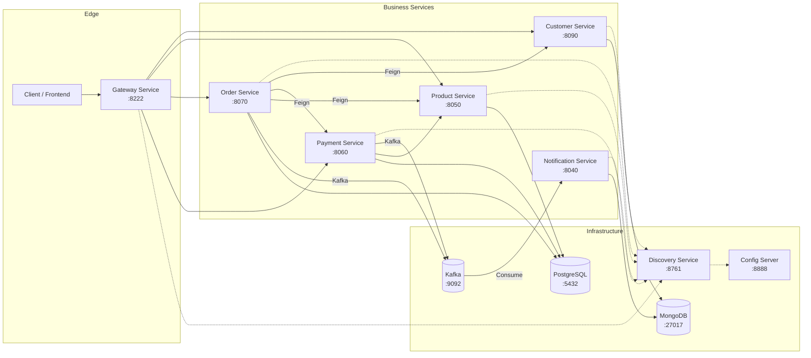

# Architecture

## Overview

The **E-Commerce Backend Platform** is a distributed, cloud-native system built on the
**Spring Cloud microservices** stack. It decomposes a monolithic e-commerce backend into
independently deployable services, each owning its own data store and exposing a REST API.
The platform demonstrates the following architectural patterns:

| Pattern | Implementation |
|---|---|
| Service Discovery | Netflix Eureka (`discovery-service`) |
| API Gateway | Spring Cloud Gateway (`gateway-service`) |
| Externalized Configuration | Spring Cloud Config Server (`config-server`) |
| Sync Inter-Service Communication | OpenFeign + Spring Cloud LoadBalancer |
| Async Event-Driven Messaging | Apache Kafka (`order-topic`, `payment-topic`) |
| Database per Service | PostgreSQL (product/order/payment) + MongoDB (customer/notification) |
| Database Migrations | Flyway (product-service) |
| Distributed Tracing | Micrometer + Brave + Zipkin |

---

## System Topology



---

## Service Catalog

| Service | Port | Database | Responsibilities |
|---|---|---|---|
| `config-server` | 8888 | — | Centralized configuration (native profile, classpath files) |
| `discovery-service` | 8761 | — | Eureka server; service registry & health monitoring |
| `gateway-service` | 8222 | — | API Gateway, routing, load balancing (`lb://`) |
| `customer-service` | 8090 | MongoDB | Customer CRUD, address management |
| `product-service` | 8050 | PostgreSQL | Product catalog, categories, inventory |
| `order-service` | 8070 | PostgreSQL | Order orchestration, order lines, saga initiation |
| `payment-service` | 8060 | PostgreSQL | Payment processing, payment confirmation events |
| `notification-service` | 8040 | MongoDB | Kafka consumers, email notifications (Thymeleaf templates) |

---

## Inter-Service Communication

### Synchronous (Feign / REST)

* **Order → Customer:** validates customer existence before order creation.
* **Order → Product:** checks stock and updates inventory before persisting an order.
* **Order → Payment:** triggers payment processing as part of the order saga.
* **Payment → Product:** secondary validation (defensive check on product ownership).

All Feign clients use **service discovery** (`lb://`) for load-balanced endpoint resolution.

### Asynchronous (Kafka)

| Topic | Producer | Consumer | Payload |
|---|---|---|---|
| `order-topic` | `order-service` | `notification-service` | `OrderConfirmation` (order ref, amount, method, customer, line items) |
| `payment-topic` | `payment-service` | `notification-service` | `PaymentNotificationRequest` (order ref, amount, method, customer info) |

Serialization: Spring Kafka JSON serializers/deserializers with type-mapping headers.

---

## Configuration Management

All runtime configuration is externalized to the **config-server** (`spring-cloud-config-server`), running with the `native` profile and reading YAML files from `classpath:/configurations/`:

* `application.yml` – shared defaults (Eureka URL, tracing sampling rate)
* `<service-name>-service.yml` – per-service overrides (ports, datasources, Kafka, mail)

Business services bootstrap with:

```yaml
spring:
  config:
    import: optional:configserver:http://localhost:8888
```

The `optional:` prefix means services will start even if the config-server is down, falling back to local defaults.

---

## Resilience & Observability

* **Distributed Tracing:** Micrometer Tracing + Brave + Zipkin reporter from client. Sampling probability = 1.0 (dev).
* **Health Checks:** Spring Boot Actuator endpoints exposed on every service.
* **Load Balancing:** Spring Cloud LoadBalancer on the gateway and Feign clients.
* **Async Processing:** Email sending is `@Async` in the notification-service to avoid blocking Kafka consumer threads.

---

## Data Consistency & Saga Pattern

The platform uses the **Orchestration Saga** pattern for the checkout flow:

1. `order-service` receives `POST /api/v1/orders`.
2. Calls `customer-service` to validate the customer (compensation: fail-fast).
3. Calls `product-service` to validate stock and reserve inventory (compensation: fail-fast).
4. Persists the order and order lines.
5. Calls `payment-service` to create the payment.
6. Publishes `OrderConfirmation` to Kafka (`order-topic`).
7. `payment-service` persists the payment and publishes `PaymentNotificationRequest` to Kafka (`payment-topic`).
8. `notification-service` consumes both events and sends the corresponding email.

This is **not** a full distributed transaction (no 2PC). It relies on eventual consistency via Kafka.
